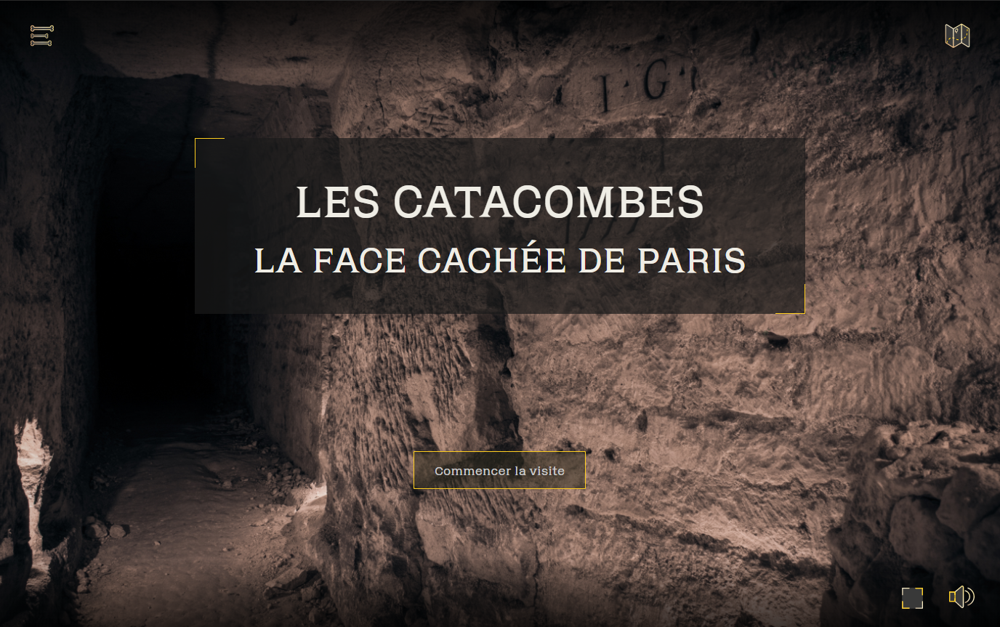

# Les catacombes, la face cachée de Paris



## Project description

There is a part of our Parisian heritage which is quite secret and intrigues everyone: The catacombs.
Unfortunately, this place is very secret (the Ktaphiles don't like to give too much information to avoid too many intrusions in this place which is sacred to them). The is only an official part, in the form of a museum, that is accessible by all. Well, not exactly, because all the people who are claustrophobic or who just don't live in Paris and don't go there, can't access it.
How about we change that?
Let us change thsi by taking you on a guided tour 30 meters underground. You won't have to crawl in the cat flaps, walk in the water or risk slipping in the mud.
We invite you to discover the history of the catacombs, the role they have played in the history of France, their anecdotes and rituals through a documented, fun and interactive visit.

## Website

:construction: Work in progress :construction:

## Project setup

```
npm install
```

### Compiles and hot-reloads for development

```
npm run serve
```

### Compiles and minifies for production

```
npm run build
```

### Lints and fixes files

```
npm run lint
```

## Built with

- **Front-end**
  - Vue.js
    - Vue router
    - Vue Page Transition
    - Vuejs VR
    - Vue2 touch eventsource
  - Axios
- **Back-end**
  - PHP
  - MySql
- **Cloud-Provider**
  - AWS

## Disclaimer

Ce site a été réalisé à des fins pédagogiques dans le cadre du cursus Bachelor de l’école HETIC. Les contenus présentés n'ont pas fait l'objet d'une demande de droit d'utilisation. Ce site ne sera, en aucun cas, exploité à des fins commerciales et ne sera pas publié.

De plus, tous les lieux présentés ont été visités par des personnes aguerries, les catacombes sont un endroit dangereux et il est interdit de s’y aventurer par arrêté préfectoral. Pour des raisons de sécurité, la carte que vous trouverez sur le site est fictive, mais les lieux présentés sont bien réels.

## Contributors

- [Melina Chamayou](https://github.com/Klochette) :sparkles:
- [Constance Petillot](https://github.com/cpetillot) :pencil:
- [Camy Cerin](https://github.com/CamyCerin) :art:
- [Hugo Borini](https://github.com/hugoborini) :penguin:
- [Hugo Cordillot](https://github.com/Hgo0123) :alembic:
- [Nawel Berrichi](https://github.com/berrichinawel) :fire:

## License

[MIT](https://choosealicense.com/licenses/mit/)
